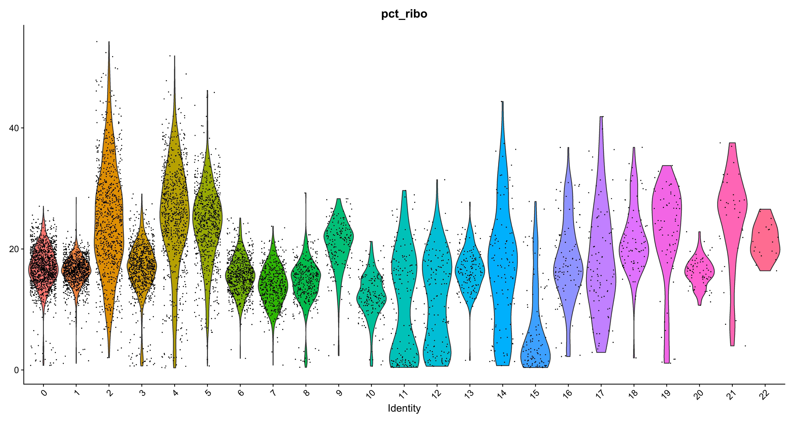
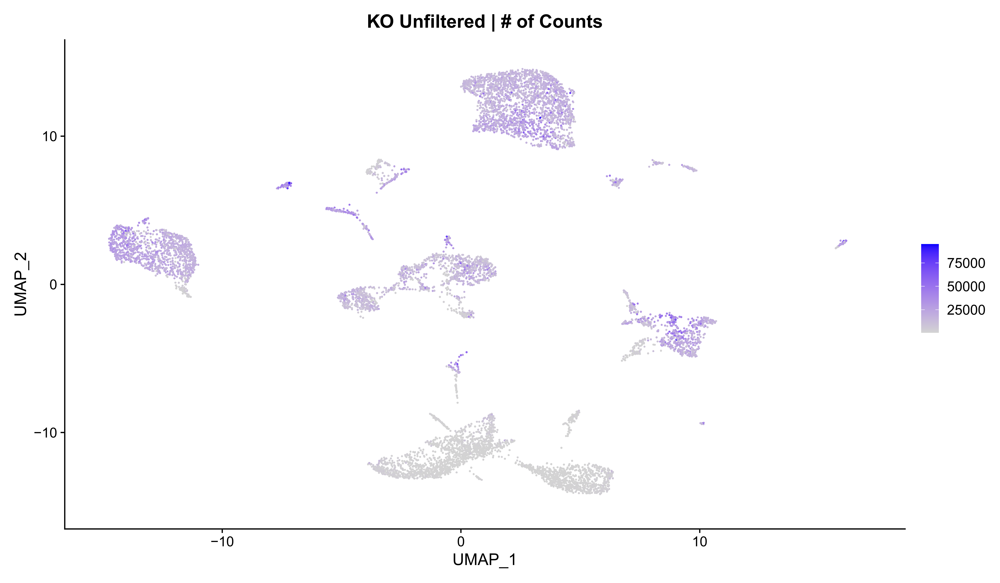
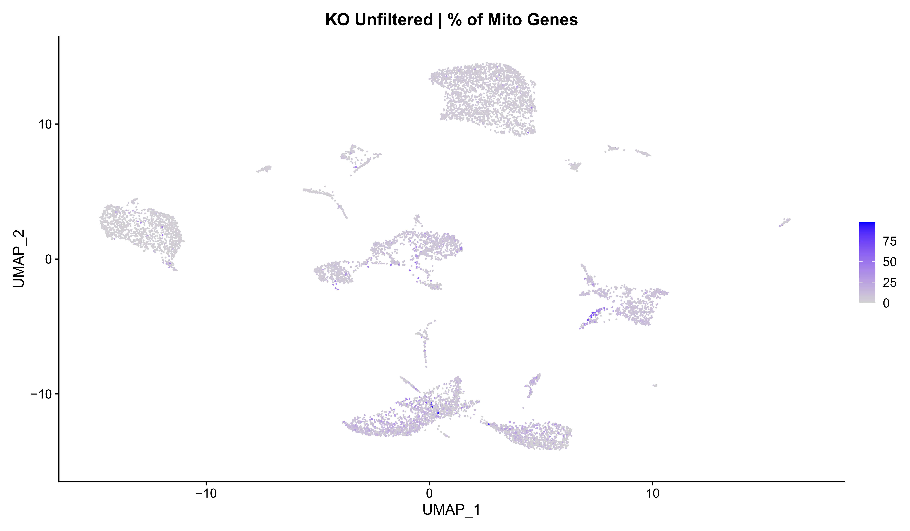
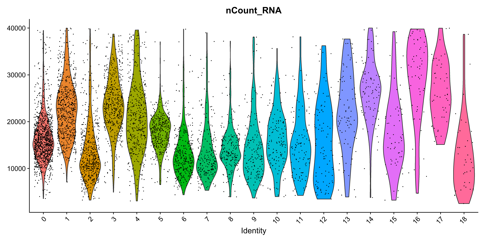
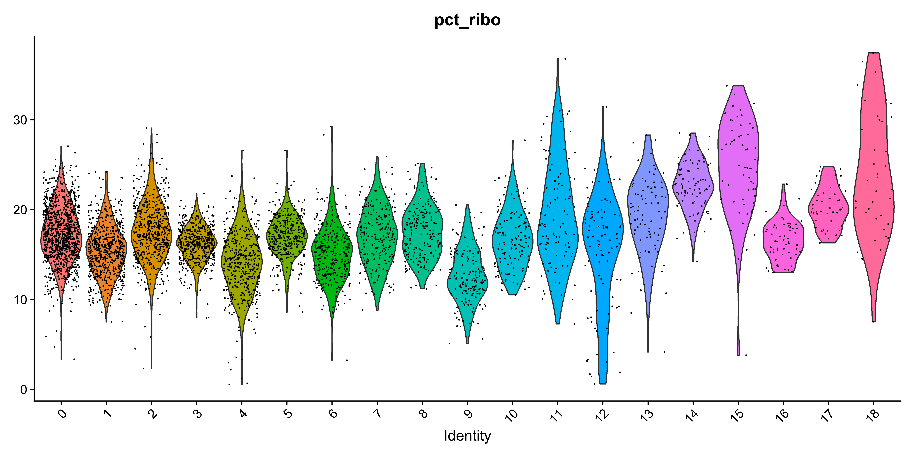
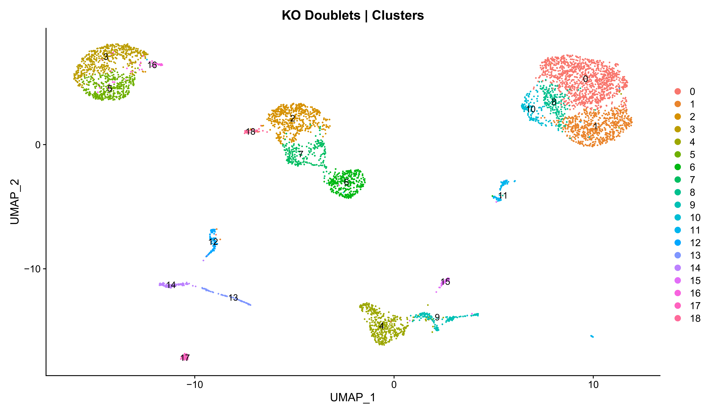
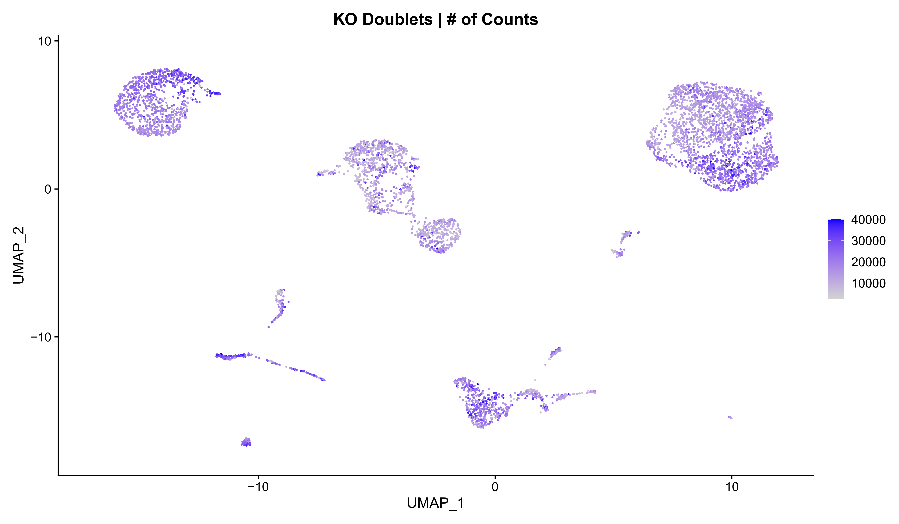
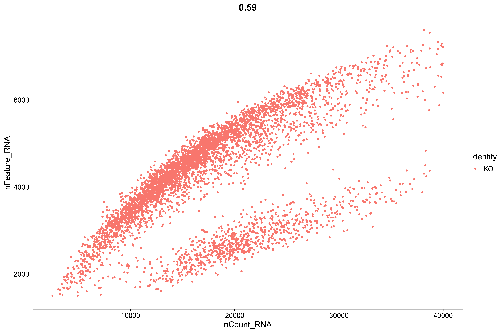
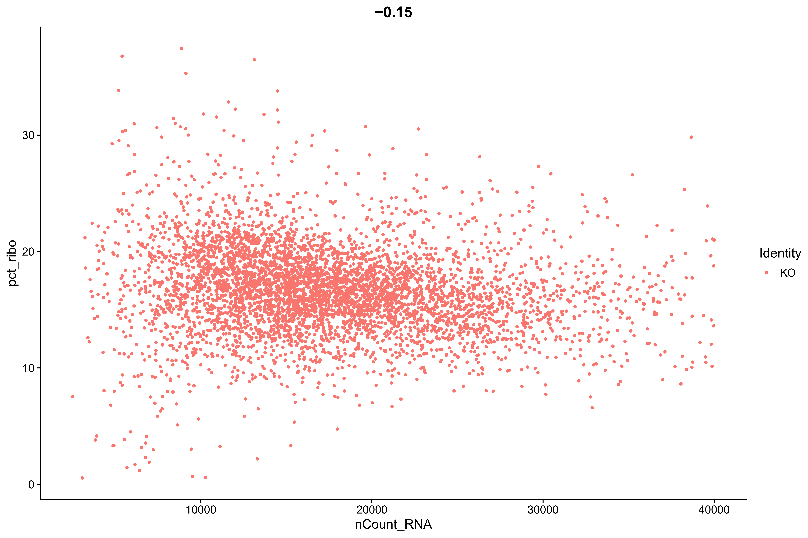
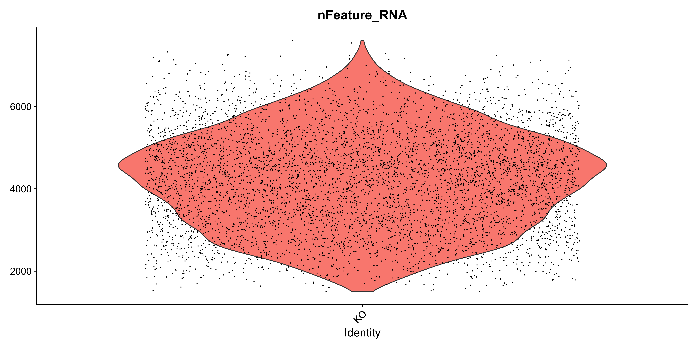

KO Quality Control and Cell Cycle Scoring
================
Aaron Mohammed

``` r
library(Seurat)
library(SingleCellExperiment)
library(DropletQC)
library(scDblFinder)
library(ggplot2)
library(qpdf)
library(openxlsx)

proj_path <- dirname(getwd())

KO_dir <- file.path(getwd(), "KO_QC")
dir.create(KO_dir)

KO_plots <- file.path(KO_dir, "KO_Plots")
dir.create(KO_plots)

KO_rds <- file.path(KO_dir, "KO_RDS_Files")
dir.create(KO_rds)

KO_markers <- file.path(KO_dir, "KO_Markers")
dir.create(KO_markers)
```

## Create KO Seurat Object

``` r
# Import count matrix for the wildtype 
KO_mat <- Read10X(file.path(proj_path, 
                            "KO",
                            "outs",
                            "filtered_feature_bc_matrix"),  
                  gene.column = 2,  
                  cell.column = 1,  
                  unique.features = TRUE,  
                  strip.suffix = FALSE)

# Create seurat object for the wildtype
KO_s <- CreateSeuratObject(KO_mat, 
                           project = "KO")

# Calculate percentages of mitochondrial and ribosomal genes
KO_s <- PercentageFeatureSet(KO_s, 
                             "^mt-", 
                             col.name = "pct_mito")
KO_s <- PercentageFeatureSet(KO_s, 
                             "^Rp[sl]\\d+", 
                             col.name = "pct_ribo")

# Normalize 
KO_s <- NormalizeData(KO_s)

# Number of cells
nrow(KO_s@meta.data) # 8666
```

## KO DropletQC

``` r
KO_nf <- nuclear_fraction_tags(outs = file.path(proj_path,
                                                "KO",
                                                "outs"),
                               tiles = 1, cores = 9, verbose = FALSE)

saveRDS(KO_nf, file.path(KO_rds, "0_KO_nuclear_fraction.rds"))

identical(row.names(KO_s@meta.data), row.names(KO_nf)) # True

KO_s <- AddMetaData(KO_s, KO_nf$nuclear_fraction, col.name = "nuclear_fraction")

################################################################################

KO_s.nf.umi <- data.frame(nf=KO_s$nuclear_fraction,
                         umi=KO_s$nCount_RNA)

# Identify empty droplets
KO_s.ed <- identify_empty_drops(nf_umi=KO_s.nf.umi)

################################################################################

KO_s <- FindVariableFeatures(KO_s, 
                             selection.method = "vst", 
                             nfeatures = 2000)
KO_s <- ScaleData(KO_s)
KO_s <- RunPCA(KO_s)

# Determine number of dimensions that capture at least 80% of the variation
pct <- KO_s[["pca"]]@stdev / sum(KO_s[["pca"]]@stdev) * 100
cumu <- cumsum(pct)
PC_80_pct <- which(cumu >= 80)[1]
PC_80_pct #31

# UMAP and clustering
KO_s <- FindNeighbors(KO_s, 
                      dims = 1:PC_80_pct)
KO_s <- RunUMAP(KO_s, 
                dims=1:PC_80_pct)

KO_s <- FindClusters(KO_s, 
                     resolution = 0.6)

KO_s <- AddMetaData(KO_s, KO_s$seurat_clusters, col.name = "KO_SC_1")

################################################################################

KO_s.ed$cell_type <- KO_s$KO_SC_1

# Identify damaged cells
KO_s.ed.dc <- identify_damaged_cells(KO_s.ed, verbose = FALSE, output_plots = FALSE)

KO_s <- AddMetaData(KO_s, KO_s.ed.dc$df$cell_status, col.name = "DropletQC")

# Save the seurat object
saveRDS(KO_s, file.path(KO_rds, "0_KO_seurat.rds"))
```

## Unfiltered KO Plots

``` r
# Ranges of counts, expressed genes, and percent mitochondria gene expression
range(KO_s$nCount_RNA) # min = 500; max = 94972
range(KO_s$nFeature_RNA) # min = 60; max = 9927
range(KO_s$pct_mito) # min = 0%; max = 97.5%
range(KO_s$pct_ribo) # min = 0.35%; max = 54.27%

pdf(file.path(KO_plots, "0_KO_unfiltered_scatter_plots.pdf"), height = 8, width = 12)
FeatureScatter(KO_s,
               feature1 = "nCount_RNA", 
               feature2 = "nFeature_RNA", 
               group.by = "DropletQC") +
  ggtitle("KO - Unfiltered")
# # # # # # # # # # # # # # # # # # # # # # # #
FeatureScatter(KO_s,
               feature1 = "nCount_RNA", 
               feature2 = "pct_mito", 
               group.by = "DropletQC") +
  ggtitle("KO - Unfiltered")
# # # # # # # # # # # # # # # # # # # # # # # #
FeatureScatter(KO_s,
               feature1 = "nCount_RNA", 
               feature2 = "pct_ribo", 
               group.by = "DropletQC") +
  ggtitle("KO - Unfiltered")
# # # # # # # # # # # # # # # # # # # # # # # #
FeatureScatter(KO_s,
               feature1 = "nFeature_RNA", 
               feature2 = "nCount_RNA", 
               group.by = "DropletQC") +
  ggtitle("KO - Unfiltered")
# # # # # # # # # # # # # # # # # # # # # # # #
FeatureScatter(KO_s,
               feature1 = "nFeature_RNA", 
               feature2 = "pct_mito", 
               group.by = "DropletQC") +
  ggtitle("KO - Unfiltered")
# # # # # # # # # # # # # # # # # # # # # # # #
FeatureScatter(KO_s,
               feature1 = "nFeature_RNA", 
               feature2 = "pct_ribo", 
               group.by = "DropletQC") +
  ggtitle("KO - Unfiltered")
# # # # # # # # # # # # # # # # # # # # # # # #
FeatureScatter(KO_s,
               feature1 = "nuclear_fraction", 
               feature2 = "nCount_RNA", 
               group.by = "DropletQC") +
  ggtitle("KO - Unfiltered")
# # # # # # # # # # # # # # # # # # # # # # # #
FeatureScatter(KO_s,
               feature1 = "nuclear_fraction", 
               feature2 = "nFeature_RNA", 
               group.by = "DropletQC") +
  ggtitle("KO - Unfiltered")
# # # # # # # # # # # # # # # # # # # # # # # #
FeatureScatter(KO_s,
               feature1 = "nuclear_fraction", 
               feature2 = "pct_mito", 
               group.by = "DropletQC") +
  ggtitle("KO - Unfiltered")
# # # # # # # # # # # # # # # # # # # # # # # #
FeatureScatter(KO_s,
               feature1 = "nuclear_fraction", 
               feature2 = "pct_ribo", 
               group.by = "DropletQC") +
  ggtitle("KO - Unfiltered")
dev.off()
```


``` r
# Violin plots
pdf(file.path(KO_plots, "KO_unfiltered_vln_plots_1.pdf"), height = 6, width = 8)
VlnPlot(KO_s, 
        features = "nCount_RNA", 
        group.by = "orig.ident") + 
  theme(legend.position="none")
# # # # # # # # # # # # # # # # 
VlnPlot(KO_s, 
        features = "nFeature_RNA", 
        group.by = "orig.ident") + 
  theme(legend.position="none")
# # # # # # # # # # # # # # # # 
VlnPlot(KO_s, 
        features = "pct_mito", 
        group.by = "orig.ident") + 
  theme(legend.position="none")
# # # # # # # # # # # # # # # # 
VlnPlot(KO_s, 
        features = "pct_ribo", 
        group.by = "orig.ident") + 
  theme(legend.position="none")
dev.off()

# Violin plots grouped by DoubletQC classifications
pdf(file.path(KO_plots, "KO_unfiltered_vln_plots_2.pdf"), height = 6, width = 12)
VlnPlot(KO_s, 
        features = "nCount_RNA", 
        group.by = "DropletQC") + 
  theme(legend.position="none")
# # # # # # # # # # # # # # # # # # # # # # # #
VlnPlot(KO_s, 
        features = "nFeature_RNA", 
        group.by = "DropletQC") + 
  theme(legend.position="none")
# # # # # # # # # # # # # # # # # # # # # # # #
VlnPlot(KO_s, 
        features = "pct_mito", 
        group.by = "DropletQC") + 
  theme(legend.position="none")
# # # # # # # # # # # # # # # # # # # # # # # #
VlnPlot(KO_s, 
        features = "pct_ribo", 
        group.by = "DropletQC") + 
  theme(legend.position="none")
dev.off()


pdf(file.path(KO_plots, "KO_unfiltered_vln_plots_3.pdf"), height = 8, width = 15)
VlnPlot(KO_s, 
        features = "nCount_RNA", 
        group.by = "KO_SC_1") + 
  theme(legend.position="none")
# # # # # # # # # # # # # #
VlnPlot(KO_s, 
        features = "nFeature_RNA", 
        group.by = "KO_SC_1") + 
  theme(legend.position="none")
# # # # # # # # # # # # # #
VlnPlot(KO_s, 
        features = "pct_mito", 
        group.by = "KO_SC_1") + 
  theme(legend.position="none")
# # # # # # # # # # # # # #
VlnPlot(KO_s, 
        features = "pct_ribo", 
        group.by = "KO_SC_1") + 
  theme(legend.position="none")
# # # # # # # # # # # # # #
VlnPlot(KO_s, 
        features = "nuclear_fraction", 
        group.by = "KO_SC_1") + 
  theme(legend.position="none")
dev.off()


# Combine violin plot pdfs
pdf_combine(input = c(file.path(KO_plots, "KO_unfiltered_vln_plots_1.pdf"),
                      file.path(KO_plots, "KO_unfiltered_vln_plots_2.pdf"),
                      file.path(KO_plots, "KO_unfiltered_vln_plots_3.pdf")),
              output = file.path(KO_plots, "0_KO_unfiltered_vln_plots.pdf"))

file.remove(c(file.path(KO_plots, "KO_unfiltered_vln_plots_1.pdf"),
              file.path(KO_plots, "KO_unfiltered_vln_plots_2.pdf"),
              file.path(KO_plots, "KO_unfiltered_vln_plots_3.pdf")))
```



``` r
# UMAP plots
pdf(file.path(KO_plots, "0_KO_unfiltered_UMAPs.pdf"), height = 7, width = 12)
UMAPPlot(KO_s, group.by = "KO_SC_1", label =TRUE) + ggtitle("KO Unfiltered | Clusters")
UMAPPlot(KO_s, group.by = "DropletQC") + ggtitle("KO Unfiltered | DropletQC Classifications")
FeaturePlot(KO_s, features = "nCount_RNA") + ggtitle("KO Unfiltered | # of Counts")
FeaturePlot(KO_s, features = "nFeature_RNA") + ggtitle("KO Unfiltered | # of Genes")
FeaturePlot(KO_s, features = "pct_mito") + ggtitle("KO Unfiltered | % of Mito Genes")
FeaturePlot(KO_s, features = "pct_ribo") + ggtitle("KO Unfiltered | % of Ribo Genes")
FeaturePlot(KO_s, features = "nuclear_fraction") + ggtitle("KO Unfiltered | Nuclear Fraction")
dev.off()
```



## Cluster Markers

``` r
get.all.markers <- function (seurat, ident, path, fname) {
  
  DefaultAssay(seurat) <- "RNA"
  seurat <- ScaleData(seurat, features = row.names(seurat))
  
  Idents(seurat) <- ident
  
  all_markers <- FindAllMarkers(seurat, logfc.threshold = 0.1)
  
  if (is.factor(seurat@meta.data[,ident])) {
    clusters <- levels(seurat@meta.data[,ident])
  } else if (is.character(seurat@meta.data[,ident])) {
    clusters <- sort(unique(seurat@meta.data[,ident]))
  }
  
  all_markers_list <- vector(mode="list", length = length(clusters))
  names(all_markers_list) <- clusters
  
  for (clust in clusters) {
    all_markers_list[[clust]] <- all_markers[which(all_markers$cluster == clust), 
                                             c("gene", "p_val", "avg_log2FC", 
                                               "pct.1", "pct.2", "p_val_adj")]
  }
  write.xlsx(all_markers_list, 
             file.path(path, fname), 
             rowNames = FALSE)
  
  return(all_markers_list)
  
}
```

``` r
all_markers <- get.all.markers(seurat = KO_s,
                               ident = "seurat_clusters",
                               path = KO_markers,
                               fname = "0_KO_cluster_markers.xlsx")
```

## KO Low-quality Filtering

``` r
KO_f <- subset(KO_s, 
               subset = nFeature_RNA <= 8000 &
                 nFeature_RNA >= 1500 & 
                 nCount_RNA >= 1000 &
                 nCount_RNA <= 40000 &
                 pct_mito <= 25)

Idents(KO_f) <- "DropletQC"
KO_f <- subset(KO_f, idents = "cell")

# Number of cells
nrow(KO_f@meta.data) # 5309
```

## KO Doublet Classifications

``` r
KO_f <- FindVariableFeatures(KO_f, 
                             selection.method = "vst", 
                             nfeatures = 2000)
KO_f <- ScaleData(KO_f)
KO_f <- RunPCA(KO_f)

# Determine number of dimensions that capture at least 80% of the variation
pct <- KO_f[["pca"]]@stdev / sum(KO_f[["pca"]]@stdev) * 100
cumu <- cumsum(pct)
PC_80_pct <- which(cumu >= 80)[1]
PC_80_pct #31

# UMAP and clustering
KO_f <- FindNeighbors(KO_f, 
                      dims = 1:PC_80_pct)
KO_f <- RunUMAP(KO_f, 
                dims=1:PC_80_pct)

KO_f <- FindClusters(KO_f, 
                     resolution = 0.6)

KO_f <- AddMetaData(KO_f, KO_f$seurat_clusters, col.name = "KO_SC_2")

################################################################################

# Doublet detection using scDblFinder
KO_sce <- as.SingleCellExperiment(KO_f, 
                                   assay = "RNA")

set.seed(123)

KO_sce <- scDblFinder(KO_sce, 
                      clusters="KO_SC_2")

identical(KO_sce@colData@rownames, row.names(KO_f@meta.data)) # TRUE
identical(KO_sce$KO_SC_2, KO_f@meta.data[,"KO_SC_2"]) # TRUE

KO_f <- AddMetaData(KO_f, KO_sce$scDblFinder.class, col.name = "scDblFinder.class")
KO_f <- AddMetaData(KO_f, KO_sce$scDblFinder.score, col.name = "scDblFinder.score")

saveRDS(KO_f, file.path(KO_rds, "1_KO_seurat.rds"))
```

## KO Plots w/ scDblFinder Classifications

``` r
pdf(file.path(KO_plots, "1_KO_doublet_scatter_plots.pdf"), height = 8, width = 12)
FeatureScatter(KO_f,
               feature1 = "nCount_RNA", 
               feature2 = "nFeature_RNA", 
               group.by = "scDblFinder.class")
# # # # # # # # # # # # # # # # # # # # # # # #
FeatureScatter(KO_f,
               feature1 = "nCount_RNA", 
               feature2 = "pct_mito", 
               group.by = "scDblFinder.class")
# # # # # # # # # # # # # # # # # # # # # # # #
FeatureScatter(KO_f,
               feature1 = "nCount_RNA", 
               feature2 = "pct_ribo", 
               group.by = "scDblFinder.class")
# # # # # # # # # # # # # # # # # # # # # # # #
FeatureScatter(KO_f,
               feature1 = "nFeature_RNA", 
               feature2 = "nCount_RNA", 
               group.by = "scDblFinder.class")
# # # # # # # # # # # # # # # # # # # # # # # #
FeatureScatter(KO_f,
               feature1 = "nFeature_RNA", 
               feature2 = "pct_mito", 
               group.by = "scDblFinder.class")
# # # # # # # # # # # # # # # # # # # # # # # #
FeatureScatter(KO_f,
               feature1 = "nFeature_RNA", 
               feature2 = "pct_ribo", 
               group.by = "scDblFinder.class")
dev.off()
```


``` r
# Violin plots grouped by scDblFinder classifications
pdf(file.path(KO_plots, "1_KO_doublet_vln_plots.pdf"), height = 6, width = 12)
VlnPlot(KO_f, 
        features = "nCount_RNA", 
        group.by = "scDblFinder.class") + 
  theme(legend.position="none")
# # # # # # # # # # # # # # # # # # # # # # # #
VlnPlot(KO_f, 
        features = "nFeature_RNA", 
        group.by = "scDblFinder.class") + 
  theme(legend.position="none")
# # # # # # # # # # # # # # # # # # # # # # # #
VlnPlot(KO_f, 
        features = "pct_mito", 
        group.by = "scDblFinder.class") + 
  theme(legend.position="none")
# # # # # # # # # # # # # # # # # # # # # # # #
VlnPlot(KO_f, 
        features = "pct_ribo", 
        group.by = "scDblFinder.class") + 
  theme(legend.position="none")
dev.off()
```


``` r
# Violin plots grouped by scDblFinder clusters
pdf(file.path(KO_plots, "1_KO_vln_scdblfinder_clusters.pdf"), height = 6, width = 12)
VlnPlot(KO_f, 
        features = "nCount_RNA", 
        group.by = "KO_SC_2") + 
  theme(legend.position="none")
# # # # # # # # # # # # # # # # # # # # # # # #
VlnPlot(KO_f, 
        features = "nFeature_RNA", 
        group.by = "KO_SC_2") + 
  theme(legend.position="none")
# # # # # # # # # # # # # # # # # # # # # # # #
VlnPlot(KO_f, 
        features = "pct_mito", 
        group.by = "KO_SC_2") + 
  theme(legend.position="none")
# # # # # # # # # # # # # # # # # # # # # # # #
VlnPlot(KO_f, 
        features = "pct_ribo", 
        group.by = "KO_SC_2") + 
  theme(legend.position="none")
dev.off()
```



``` r
# Violin plots grouped by original clusters
pdf(file.path(KO_plots, "1_KO_vln_original_clusters.pdf"), height = 6, width = 12)
VlnPlot(KO_f, 
        features = "nCount_RNA", 
        group.by = "KO_SC_1") + 
  theme(legend.position="none")
# # # # # # # # # # # # # # # # # # # # # # # #
VlnPlot(KO_f, 
        features = "nFeature_RNA", 
        group.by = "KO_SC_1") + 
  theme(legend.position="none")
# # # # # # # # # # # # # # # # # # # # # # # #
VlnPlot(KO_f, 
        features = "pct_mito", 
        group.by = "KO_SC_1") + 
  theme(legend.position="none")
# # # # # # # # # # # # # # # # # # # # # # # #
VlnPlot(KO_f, 
        features = "pct_ribo", 
        group.by = "KO_SC_1") + 
  theme(legend.position="none")
dev.off()
```


``` r
# UMAP plots
pdf(file.path(KO_plots, "1_KO_doublet_UMAPs.pdf"), height = 7, width = 12)
UMAPPlot(KO_f, group.by = "KO_SC_2", label =TRUE) + ggtitle("KO Doublets | Clusters")
UMAPPlot(KO_f, group.by = "scDblFinder.class") + ggtitle("KO Doublets | DropletQC Classifications")
FeaturePlot(KO_f, features = "nCount_RNA") + ggtitle("KO Doublets | # of Counts")
FeaturePlot(KO_f, features = "nFeature_RNA") + ggtitle("KO Doublets | # of Genes")
FeaturePlot(KO_f, features = "pct_mito") + ggtitle("KO Doublets | % of Mito Genes")
FeaturePlot(KO_f, features = "pct_ribo") + ggtitle("KO Doublets | % of Ribo Genes")
FeaturePlot(KO_f, features = "scDblFinder.score") + ggtitle("KO Doublets | scDblFinder Score")
dev.off()
```



## KO Doublet Removal

``` r
# Filter out the cells classified as doublets
Idents(KO_f) <- "scDblFinder.class"
KO_f <- subset(KO_f, idents = "singlet")

# Number of cells
nrow(KO_f@meta.data) # 4988
```

## Dim Reduction & Clustering After QC

``` r
KO_f <- FindVariableFeatures(KO_f, 
                             selection.method = "vst", 
                             nfeatures = 2000)
KO_f <- ScaleData(KO_f)
KO_f <- RunPCA(KO_f)

# Determine number of dimensions that capture at least 80% of the variation
pct <- KO_f[["pca"]]@stdev / sum(KO_f[["pca"]]@stdev) * 100
cumu <- cumsum(pct)
PC_80_pct <- which(cumu >= 80)[1]
PC_80_pct #31

# UMAP and clustering
KO_f <- FindNeighbors(KO_f, 
                      dims = 1:PC_80_pct)
KO_f <- RunUMAP(KO_f, 
                dims=1:PC_80_pct)

KO_f <- FindClusters(KO_f, 
                     resolution = 0.6)

KO_f <- AddMetaData(KO_f, KO_f$seurat_clusters, col.name = "KO_SC_3")

saveRDS(KO_f, file.path(KO_rds, "2_KO_seurat.rds"))
```

## KO Cell Cycle Scoring

``` r
s.genes <- c("Mcm5","Pcna","Tyms","Fen1","Mcm2","Mcm4","Rrm1","Ung","Gins2",
             "Mcm6","Cdca7","Dtl","Prim1","Uhrf1","Hells","Rfc2","Rpa2","Nasp",
             "Rad51ap1","Gmnn","Wdr76","Slbp","Ccne2","Ubr7","Pold3","Msh2",
             "Atad2","Rad51","Rrm2","Cdc45","Cdc6","Exo1","Tipin","Dscc1","Blm",
             "Casp8ap2","Usp1","Clspn","Pola1","Chaf1b","Brip1","E2f8")

g2m.genes <- c("Hmgb2","Cdk1","Nusap1","Ube2c","Birc5","Tpx2","Top2a","Ndc80",
               "Cks2","Nuf2","Cks1b","Mki67","Tmpo","Cenpf","Tacc3","Pimreg",
               "Smc4","Ccnb2","Ckap2l","Ckap2","Aurkb","Bub1","Kif11","Anp32e",
               "Tubb4b","Gtse1","Kif20b","Hjurp","Cdca3","Jpt1","Cdc20","Ttk",
               "Cdc25c","Kif2c","Rangap1","Ncapd2","Dlgap5","Cdca2","Cdca8",
               "Ect2","Kif23","Hmmr","Aurka","Psrc1","Anln","Lbr","Ckap5",
               "Cenpe","Ctcf","Nek2","G2e3","Gas2l3","Cbx5","Cenpa")

KO_f <- CellCycleScoring(KO_f,
                         s.features = s.genes,
                         g2m.features = g2m.genes,
                         set.ident = FALSE)

saveRDS(KO_f, file.path(KO_rds, "3_KO_seurat.rds"))
```

## KO Filtered Plots

``` r
pdf(file.path(KO_plots, "2_KO_scatter_plots.pdf"), height = 8, width = 12)
FeatureScatter(KO_f,
               feature1 = "nCount_RNA", 
               feature2 = "nFeature_RNA", 
               group.by = "orig.ident")
# # # # # # # # # # # # # # # # # # # # # # # #
FeatureScatter(KO_f,
               feature1 = "nCount_RNA", 
               feature2 = "pct_mito", 
               group.by = "orig.ident")
# # # # # # # # # # # # # # # # # # # # # # # #
FeatureScatter(KO_f,
               feature1 = "nCount_RNA", 
               feature2 = "pct_ribo", 
               group.by = "orig.ident")
# # # # # # # # # # # # # # # # # # # # # # # #
FeatureScatter(KO_f,
               feature1 = "nFeature_RNA", 
               feature2 = "nCount_RNA", 
               group.by = "orig.ident")
# # # # # # # # # # # # # # # # # # # # # # # #
FeatureScatter(KO_f,
               feature1 = "nFeature_RNA", 
               feature2 = "pct_mito", 
               group.by = "orig.ident")
# # # # # # # # # # # # # # # # # # # # # # # #
FeatureScatter(KO_f,
               feature1 = "nFeature_RNA", 
               feature2 = "pct_ribo", 
               group.by = "orig.ident")
dev.off()
```



``` r
# Violin plots grouped by scDblFinder classifications
pdf(file.path(KO_plots, "2_KO_vln_plots.pdf"), height = 6, width = 12)
VlnPlot(KO_f, 
        features = "nCount_RNA", 
        group.by = "orig.ident") + 
  theme(legend.position="none")
# # # # # # # # # # # # # # # # # # # # # # # #
VlnPlot(KO_f, 
        features = "nFeature_RNA", 
        group.by = "orig.ident") + 
  theme(legend.position="none")
# # # # # # # # # # # # # # # # # # # # # # # #
VlnPlot(KO_f, 
        features = "pct_mito", 
        group.by = "orig.ident") + 
  theme(legend.position="none")
# # # # # # # # # # # # # # # # # # # # # # # #
VlnPlot(KO_f, 
        features = "pct_ribo", 
        group.by = "orig.ident") + 
  theme(legend.position="none")
dev.off()
```



``` r
# Violin plots grouped by final clusters
pdf(file.path(KO_plots, "2_KO_vln_final_clusters.pdf"), height = 6, width = 12)
VlnPlot(KO_f, 
        features = "nCount_RNA", 
        group.by = "KO_SC_3") + 
  theme(legend.position="none")
# # # # # # # # # # # # # # # # # # # # # # # #
VlnPlot(KO_f, 
        features = "nFeature_RNA", 
        group.by = "KO_SC_3") + 
  theme(legend.position="none")
# # # # # # # # # # # # # # # # # # # # # # # #
VlnPlot(KO_f, 
        features = "pct_mito", 
        group.by = "KO_SC_3") + 
  theme(legend.position="none")
# # # # # # # # # # # # # # # # # # # # # # # #
VlnPlot(KO_f, 
        features = "pct_ribo", 
        group.by = "KO_SC_3") + 
  theme(legend.position="none")
dev.off()
```


``` r
# UMAP plots
pdf(file.path(KO_plots, "2_KO_UMAPs.pdf"), height = 7, width = 12)
UMAPPlot(KO_f, group.by = "KO_SC_3", label =TRUE) + ggtitle("KO | Clusters")
UMAPPlot(KO_f, group.by = "Phase", label =FALSE) + ggtitle("KO | Cell Cycle")
FeaturePlot(KO_f, features = "nCount_RNA") + ggtitle("KO | # of Counts")
FeaturePlot(KO_f, features = "nFeature_RNA") + ggtitle("KO | # of Genes")
FeaturePlot(KO_f, features = "pct_mito") + ggtitle("KO | % of Mito Genes")
FeaturePlot(KO_f, features = "pct_ribo") + ggtitle("KO | % of Ribo Genes")
dev.off()
```


``` r
# Clean up the seurat (it'll later be merged with the WT seurat, this is just my way of making the 
# final merged seurat organized)

KO_f$RNA_snn_res.0.6 <- NULL 
KO_f$seurat_clusters <- NULL 

saveRDS(KO_f, file.path(getwd(), "KO_seurat.rds"))
```
