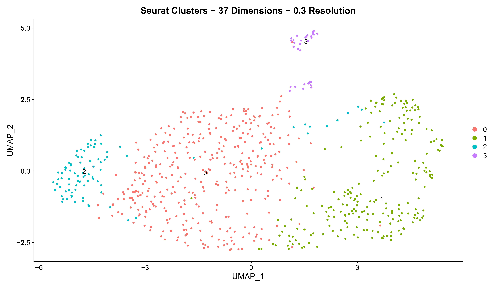
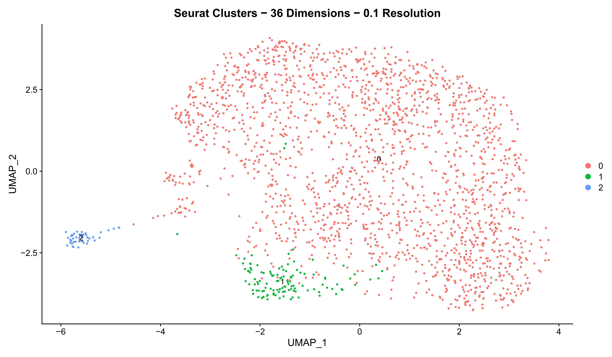
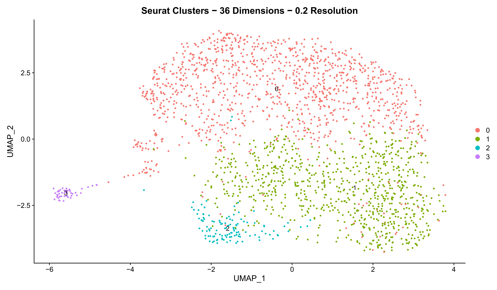
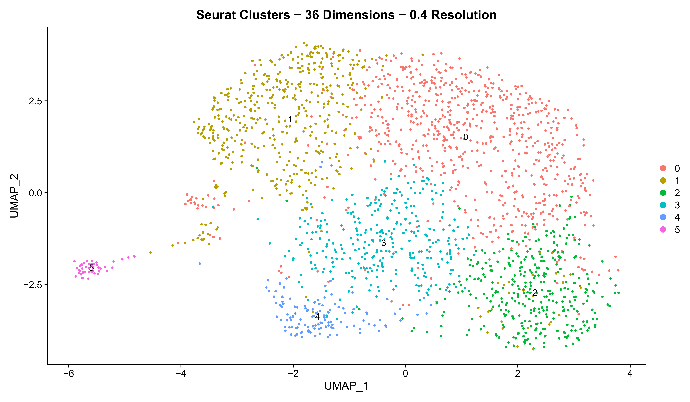

KO Annotation
================
Aaron Mohammed

``` r
library(Seurat)
library(ggplot2)
library(qpdf)
library(openxlsx)
library(plotly)
library(clusterProfiler)
library(org.Mm.eg.db)

seurat_input_dir <- file.path(getwd(), "singleR_annotated_seurats")

KO_dir <- file.path(getwd(), "KO")
dir.create(KO_dir)

plots_dir <- file.path(KO_dir, "Plots")
dir.create(plots_dir)

markers_dir <- file.path(KO_dir, "Markers")
dir.create(markers_dir)

RDS_dir <- file.path(KO_dir, "RDS_files")
dir.create(RDS_dir)
```

``` r
# Read in KO seurat
KO_s <- readRDS(file.path(seurat_input_dir, "KO_singleR_annotated.rds"))

Idents(KO_s) <- "orig.ident"

KO_s$KO_SC_1 <- NULL
KO_s$KO_SC_2 <- NULL
KO_s$KO_SC_3 <- NULL
```

``` r
umap.func <- function (seurat, nfeat = 2000, cc_regress = FALSE, 
                       pca_npcs = 50, cumm_var = NULL, dims = NULL,
                       verb = FALSE) {
  
  if (is.null(cumm_var) & is.null(dims)) {
    stop("Number of PCs to use has not been set, use either 'cumm_var' or 'dims' to set it")
  } else if (!is.null(cumm_var) & !is.null(dims)) {
    stop("Set the number of PCs to use with either 'cumm_var' or 'dims', not both")
  } 
  
  DefaultAssay(seurat) <- "RNA"
  
  seurat <- FindVariableFeatures(seurat, 
                                 selection.method = "vst", 
                                 nfeatures = nfeat)
  
  if (cc_regress == TRUE) {
    seurat <- ScaleData(seurat, 
                        vars.to.regress = c("S.Score", "G2M.Score"),
                        verbose = verb)
  } else if (cc_regress == FALSE) {
    seurat <- ScaleData(seurat,
                        verbose = verb)
  }
  
  # Principal component analysis
  seurat <- RunPCA(seurat, 
                   npcs = pca_npcs,
                   verbose = verb)
  
  if (!is.null(cumm_var)) {
    
  # Percent variation associated with each PC
  pct <- seurat[["pca"]]@stdev / sum(seurat[["pca"]]@stdev) * 100
  
  # Cumulative variation with increasing number of PCs
  cumu <- cumsum(pct)
  
  PC <- which(cumu >= cumm_var)[1] 
  
  seurat <- FindNeighbors(seurat, 
                          dims = 1:PC,
                          verbose = verb)
  seurat <- RunUMAP(seurat,
                    dims = 1:PC,
                    verbose = verb)
  
  } else if (!is.null(dims)) {
    
    seurat <- FindNeighbors(seurat, 
                            dims = 1:dims,
                            verbose = verb)
    seurat <- RunUMAP(seurat,
                      dims = 1:dims,
                      verbose = verb)
    
  }
  
  return(seurat)

}
```

``` r
sweep.cluster.res <- function (seurat, res, path, fname) {
  
  i = 1
  file_paths <- vector(length = length(res))
  
  dims <- length(seurat@commands[["RunUMAP.RNA.pca"]]@params[["dims"]])
  
  for (r in res) {
    
    seurat <- FindClusters(seurat, 
                           resolution = r,
                           verbose = FALSE)
    
    title <- paste0("Seurat Clusters", sep= " - ",
                    dims, sep= " ",
                    "Dimensions", sep= " - ",
                    r, sep= " ",
                    "Resolution")
    
    file_name <- paste0("cluster_umap", sep= "_",
                        r, sep= "_",
                        "res.pdf")
    
    file_paths[i] <- file.path(path, file_name)
    
    pdf(file_paths[i], height = 7, width = 12)
    print(UMAPPlot(seurat, 
                   group.by = "seurat_clusters", 
                   label = TRUE) +
            ggtitle(title))
    dev.off()
    
    i = i + 1
    
  }
  
  pdf_combine(input = file_paths, 
              output = file.path(path, fname))
  
  file.remove(file_paths)
  
}
```

``` r
get.cons.markers <- function (seurat, ident, group, path, fname) {
  
  DefaultAssay(seurat) <- "RNA"
  seurat <- ScaleData(seurat, features = row.names(seurat))
  
  Idents(seurat) <- ident
  
  if (is.factor(seurat@meta.data[,ident])) {
    clusters <- levels(seurat@meta.data[,ident])
  } else if (is.character(seurat@meta.data[,ident])) {
    clusters <- sort(unique(seurat@meta.data[,ident]))
  }
  
  conserved_markers <- vector(mode = "list", length = length(clusters))
  names(conserved_markers) <- clusters
  
  for (clust in clusters) {
    conserved_markers[[clust]] <- FindConservedMarkers(seurat, 
                                                       ident.1 = clust,
                                                       grouping.var = group)
  }
  
  write.xlsx(conserved_markers, 
             file.path(path, fname), 
             rowNames = TRUE)
  
  return(conserved_markers)
  
}
```

``` r
get.all.markers <- function (seurat, ident, path, fname) {
  
  DefaultAssay(seurat) <- "RNA"
  seurat <- ScaleData(seurat, features = row.names(seurat))
  
  Idents(seurat) <- ident
  
  all_markers <- FindAllMarkers(seurat, logfc.threshold = 0.1)
  
  if (is.factor(seurat@meta.data[,ident])) {
    clusters <- levels(seurat@meta.data[,ident])
  } else if (is.character(seurat@meta.data[,ident])) {
    clusters <- sort(unique(seurat@meta.data[,ident]))
  }
  
  all_markers_list <- vector(mode="list", length = length(clusters))
  names(all_markers_list) <- clusters
  
  for (clust in clusters) {
    all_markers_list[[clust]] <- all_markers[which(all_markers$cluster == clust), 
                                             c("gene", "p_val", "avg_log2FC", 
                                               "pct.1", "pct.2", "p_val_adj")]
  }
  write.xlsx(all_markers_list, 
             file.path(path, fname), 
             rowNames = FALSE)
  
  return(all_markers_list)
  
}
```

``` r
KO_s <- umap.func(seurat = KO_s,
                  nfeat = 2000,
                  cc_regress = TRUE,
                  pca_npcs = 50,
                  cumm_var = 80,
                  verb = FALSE)

res <- seq(0.1,1.5,by=0.1)

KO_s <- FindClusters(KO_s, 
                         resolution = res,
                         verbose = FALSE)

sweep.cluster.res(seurat = KO_s,
                  res = res,
                  path = plots_dir,
                  fname = "1_KO_cluster_res_sweep.pdf")
```


``` r
KO_s <- FindClusters(KO_s, 
                         resolution = 0.8,
                         verbose = FALSE)

KO_s$KO_clusters <- KO_s$seurat_clusters

UMAPPlot(KO_s, group.by = "KO_clusters", label = TRUE)

saveRDS(KO_s, file.path(RDS_dir, "1_KO_seurat.rds"))
```

``` r
all_markers <- get.all.markers(seurat = KO_s,
                               ident = "KO_clusters",
                               path = markers_dir,
                               fname = "1_KO_markers.xlsx")

saveRDS(all_markers, file.path(markers_dir, "1_KO_markers.rds"))


# MP
FeaturePlot(KO_s, features = "Osr1")
FeaturePlot(KO_s, features = "Foxf1")
FeaturePlot(KO_s, features = "Rgs5")
FeaturePlot(KO_s, features = "Isl1")
FeaturePlot(KO_s, features = "Tbx1")
FeaturePlot(KO_s, features = "Fgf10")
FeaturePlot(KO_s, features = "Mfap4")

# Mes
FeaturePlot(KO_s, features = "Postn")
FeaturePlot(KO_s, features = "Cthrc1")
FeaturePlot(KO_s, features = "Sox9")
FeaturePlot(KO_s, features = "Pdgfra")
FeaturePlot(KO_s, features = "Papss2")

# Epicardial
FeaturePlot(KO_s, features = "Wt1")
FeaturePlot(KO_s, features = "Upk3b")
FeaturePlot(KO_s, features = "Aldh1a2")
FeaturePlot(KO_s, features = "Tbx18")
FeaturePlot(KO_s, features = "Sparc")
FeaturePlot(KO_s, features = "Upk1b")
FeaturePlot(KO_s, features = "Tmem255a")
FeaturePlot(KO_s, features = "Kcne1l")

# Blood
FeaturePlot(KO_s, features = "Hba-a1") # Erythroid
FeaturePlot(KO_s, features = "Hba-a2") # Erythroid
FeaturePlot(KO_s, features = "Hbb-bt") # Erythroid
FeaturePlot(KO_s, features = "Alas2") # Erythroid
FeaturePlot(KO_s, features = "Fcgr1") # Immune
FeaturePlot(KO_s, features = "C1qa") # Immune
FeaturePlot(KO_s, features = "Cd68") # Immune
FeaturePlot(KO_s, features = "Rgs18") # Platelet
FeaturePlot(KO_s, features = "Pf4") # Platelet
FeaturePlot(KO_s, features = "Tubb1") # Platelet
```

``` r
KO_s <- AddMetaData(KO_s, rep(NA, length= nrow(KO_s@meta.data)), col.name = "broad_annot_1")

"Myocardial" -> KO_s@meta.data[which(KO_s$KO_clusters == 4 |
                                     KO_s$KO_clusters == 8 |
                                     KO_s$KO_clusters == 17), 
                               "broad_annot_1"]

"Epicardial" -> KO_s@meta.data[which(KO_s$KO_clusters == 0 |
                                     KO_s$KO_clusters == 1 |
                                     KO_s$KO_clusters == 9), 
                               "broad_annot_1"]


"Endocardial" -> KO_s@meta.data[which(KO_s$KO_clusters == 3 |
                                     KO_s$KO_clusters == 7 |
                                     KO_s$KO_clusters == 16), 
                               "broad_annot_1"]

"Mesenchymal" -> KO_s@meta.data[which(KO_s$KO_clusters == 5), 
                               "broad_annot_1"]

"MP" -> KO_s@meta.data[which(KO_s$KO_clusters == 10 |
                               KO_s$KO_clusters == 14), 
                               "broad_annot_1"]

"Blood" -> KO_s@meta.data[which(KO_s$KO_clusters == 2 |
                                     KO_s$KO_clusters == 6 |
                                     KO_s$KO_clusters == 11 |
                                     KO_s$KO_clusters == 12 |
                                     KO_s$KO_clusters == 13), 
                               "broad_annot_1"]

"Hepatocyte" -> KO_s@meta.data[which(KO_s$KO_clusters == 15), 
                               "broad_annot_1"]
```

``` r
UMAPPlot(KO_s, group.by = "KO_clusters", label = TRUE)
KO_umap <- UMAPPlot(KO_s, group.by = "broad_annot_1", label = TRUE)

KO_myo_cells <- CellSelector(KO_umap)

KO_epi_cells <- CellSelector(KO_umap)

KO_endo_cells <- CellSelector(KO_umap)

KO_mes_cells <- CellSelector(KO_umap)

KO_MP_cells <- CellSelector(KO_umap)
KO_MP_cells <- c(KO_MP_cells, CellSelector(KO_umap))

KO_blo_cells <- CellSelector(KO_umap)
KO_blo_cells <- c(KO_blo_cells, CellSelector(KO_umap))

KO_hep_cells <- CellSelector(KO_umap)

KO_s <- AddMetaData(KO_s, KO_s$broad_annot_1, col.name = "broad_annot_2")

"Myocardial" -> KO_s@meta.data[KO_myo_cells, "broad_annot_2"]
"Epicardial" -> KO_s@meta.data[KO_epi_cells, "broad_annot_2"]
"Endocardial" -> KO_s@meta.data[KO_endo_cells, "broad_annot_2"]
"Mesenchymal" -> KO_s@meta.data[KO_mes_cells, "broad_annot_2"]
"MP" -> KO_s@meta.data[KO_MP_cells, "broad_annot_2"]
"Blood" -> KO_s@meta.data[KO_blo_cells, "broad_annot_2"]
"Hepatocyte" -> KO_s@meta.data[KO_hep_cells, "broad_annot_2"]


UMAPPlot(KO_s, group.by = "broad_annot_2")
```

``` r
Idents(KO_s) <- "broad_annot_2"
KO_myo <- subset(KO_s, idents = "Myocardial")
KO_epi <- subset(KO_s, idents = "Epicardial")
KO_endo <- subset(KO_s, idents = "Endocardial")
```

``` r
umap.res.sweep <- function(seurat, nfeat = 2000, cc_regress = FALSE, 
                           pca_npcs = 50, cumm_var = NULL, dims = NULL,
                           verb = FALSE, res , path, fname) {
  
  seurat <- umap.func(seurat = seurat,
                    nfeat = nfeat,
                    cc_regress = cc_regress,
                    pca_npcs = pca_npcs,
                    cumm_var = cumm_var,
                    dims = dims,
                    verb = verb)

seurat <- FindClusters(seurat, 
                         resolution = res,
                         verbose = verb)

sweep.cluster.res(seurat = seurat,
                  res = res,
                  path = path,
                  fname = fname)

return(seurat)
  
}
```

``` r
res <- seq(0.1,1.5,by=0.1)

KO_endo <- umap.res.sweep(seurat = KO_endo,
                          nfeat = 2000,
                          cc_regress = TRUE,
                          pca_npcs = 50,
                          cumm_var = 80,
                          res = res,
                          path = plots_dir,
                          fname = "2_KO_endo_res_sweep.pdf",
                          verb = FALSE)
```



``` r
UMAPPlot(KO_myo, group.by = "broad_annot_2")
KO_myo <- umap.res.sweep(seurat = KO_myo,
                          nfeat = 2000,
                          cc_regress = TRUE,
                          pca_npcs = 50,
                          cumm_var = 80,
                          res = res,
                          path = plots_dir,
                          fname = "2_KO_myo_res_sweep.pdf",
                          verb = FALSE)
```


``` r
KO_epi <- umap.res.sweep(seurat = KO_epi,
                          nfeat = 2000,
                          cc_regress = TRUE,
                          pca_npcs = 50,
                          cumm_var = 80,
                          res = res,
                          path = plots_dir,
                          fname = "2_KO_epi_res_sweep.pdf",
                          verb = FALSE)
```



``` r
KO_mes <- umap.res.sweep(seurat = KO_mes,
                          nfeat = 2000,
                          cc_regress = TRUE,
                          pca_npcs = 50,
                          cumm_var = 80,
                          res = res,
                          path = plots_dir,
                          fname = "2_KO_mes_res_sweep.pdf",
                          verb = FALSE)
```


``` r
KO_mp <- umap.res.sweep(seurat = KO_mp,
                          nfeat = 2000,
                          cc_regress = TRUE,
                          pca_npcs = 50,
                          cumm_var = 80,
                          res = res,
                          path = plots_dir,
                          fname = "2_KO_mp_res_sweep.pdf",
                          verb = FALSE)
```


``` r
KO_blo <- umap.res.sweep(seurat = KO_blo,
                          nfeat = 2000,
                          cc_regress = TRUE,
                          pca_npcs = 50,
                          cumm_var = 80,
                          res = res,
                          path = plots_dir,
                          fname = "2_KO_blo_res_sweep.pdf",
                          verb = FALSE)
```


``` r
KO_myo <- FindClusters(KO_myo, 
                        resolution = 1.4,
                        verbose = FALSE)

KO_myo <- AddMetaData(KO_myo, KO_myo$seurat_clusters, col.name = "KO_myo_SC")

KO_endo <- FindClusters(KO_endo, 
                        resolution = 0.3,
                        verbose = FALSE)

KO_endo <- AddMetaData(KO_endo, KO_endo$seurat_clusters, col.name = "KO_endo_SC")

KO_epi <- FindClusters(KO_epi, 
                        resolution = 0.4,
                        verbose = FALSE)

KO_epi <- AddMetaData(KO_epi, KO_epi$seurat_clusters, col.name = "KO_epi_SC")
```

``` r
all_markers <- get.all.markers(seurat = KO_endo,
                               ident = "seurat_clusters",
                               path = markers_dir,
                               fname = "2_KO_endo_markers.xlsx")
saveRDS(all_markers, file.path(markers_dir, "2_KO_endo_markers.rds"))

################################################################################

all_markers <- get.all.markers(seurat = KO_myo,
                               ident = "seurat_clusters",
                               path = markers_dir,
                               fname = "2_KO_myo_markers.xlsx")
saveRDS(all_markers, file.path(markers_dir, "2_KO_myo_markers.rds"))

################################################################################

all_markers <- get.all.markers(seurat = KO_epi,
                               ident = "seurat_clusters",
                               path = markers_dir,
                               fname = "2_KO_epi_markers.xlsx")
saveRDS(all_markers, file.path(markers_dir, "2_KO_epi_markers.rds"))
```

``` r
UMAPPlot(KO_myo, group.by = "KO_myo_SC", label = TRUE)

"Ventricular" -> KO_myo@meta.data[which(KO_myo$KO_myo_SC == 1 |
                                        KO_myo$KO_myo_SC == 2 |
                                        KO_myo$KO_myo_SC == 3 |
                                        KO_myo$KO_myo_SC == 5 |
                                        KO_myo$KO_myo_SC == 6), 
                                  "KO_myo_annot"]

"SAN_1" -> KO_myo@meta.data[which(KO_myo$KO_myo_SC == 7), "KO_myo_annot"]

"SAN_2" -> KO_myo@meta.data[which(KO_myo$KO_myo_SC == 8), "KO_myo_annot"]

"OFT" -> KO_myo@meta.data[which(KO_myo$KO_myo_SC == 0), "KO_myo_annot"]

"AVC" -> KO_myo@meta.data[which(KO_myo$KO_myo_SC == 4), "KO_myo_annot"]

"Atrial" -> KO_myo@meta.data[which(KO_myo$KO_myo_SC == 9), "KO_myo_annot"]

UMAPPlot(KO_myo, group.by = "KO_myo_annot", label = TRUE)

KO_myo <- AddMetaData(KO_myo, KO_myo$KO_myo_annot, col.name = "specific_annot_1")
```

``` r
UMAPPlot(KO_endo, group.by = "KO_endo_SC", label = TRUE)

"Endothelial" -> KO_endo@meta.data[which(KO_endo$KO_endo_SC == 0 |
                                        KO_endo$KO_endo_SC == 2), 
                                  "KO_endo_annot"]

"EndMT" -> KO_endo@meta.data[which(KO_endo$KO_endo_SC == 1), "KO_endo_annot"]

"Vascular_EC" -> KO_endo@meta.data[which(KO_endo$KO_endo_SC == 3), "KO_endo_annot"]

cells <- CellSelector(UMAPPlot(KO_endo, group.by = "specific_annot_1"))
"Endothelial" -> KO_endo@meta.data[cells, "KO_endo_annot"]

UMAPPlot(KO_endo, group.by = "KO_endo_annot", label = TRUE)

KO_endo <- AddMetaData(KO_endo, KO_endo$KO_endo_annot, col.name = "specific_annot_1")
```

``` r
UMAPPlot(KO_epi, group.by = "KO_epi_SC", label = TRUE)

"Epithelial" -> KO_epi@meta.data[which(KO_epi$KO_epi_SC == 0 |
                                       KO_epi$KO_epi_SC == 1 |
                                       KO_epi$KO_epi_SC == 2 |
                                       KO_epi$KO_epi_SC == 5),
                                 "KO_epi_annot"]

"EpiMT" -> KO_epi@meta.data[which(KO_epi$KO_epi_SC == 3 |
                                  KO_epi$KO_epi_SC == 4), 
                            "KO_epi_annot"]

UMAPPlot(KO_epi, group.by = "KO_epi_annot", label = TRUE)

KO_epi <- AddMetaData(KO_epi, KO_epi$KO_epi_annot, col.name = "specific_annot_1")

UMAPPlot(KO_epi, group.by = "specific_annot_1", label = TRUE)

FeaturePlot(KO_epi, features = "nCount_RNA")
FeaturePlot(KO_epi, features = "pct_mito")
```

``` r
saveRDS(KO_endo, file.path(RDS_dir, "KO_endo.rds"))
saveRDS(KO_myo, file.path(RDS_dir, "KO_myo.rds"))
saveRDS(KO_epi, file.path(RDS_dir, "KO_epi.rds"))
```

``` r
KO_s <- AddMetaData(KO_s, rep(NA, length=nrow(KO_s@meta.data)), col.name = "specific_annot_1")

for (cell in row.names(KO_myo@meta.data)) {
  KO_myo@meta.data[cell, "specific_annot_1"] -> KO_s@meta.data[which(row.names(KO_s@meta.data) == cell), "specific_annot_1"]
}

for (cell in row.names(KO_endo@meta.data)) {
  KO_endo@meta.data[cell, "specific_annot_1"] -> KO_s@meta.data[which(row.names(KO_s@meta.data) == cell), "specific_annot_1"]
}

for (cell in row.names(KO_epi@meta.data)) {
  KO_epi@meta.data[cell, "specific_annot_1"] -> KO_s@meta.data[which(row.names(KO_s@meta.data) == cell), "specific_annot_1"]
}


"Blood" -> KO_s$specific_annot_1[which(KO_s$broad_annot_2 == "Blood")]
"Mesenchymal" -> KO_s$specific_annot_1[which(KO_s$broad_annot_2 == "Mesenchymal")]
"MP" -> KO_s$specific_annot_1[which(KO_s$broad_annot_2 == "MP")]
"Hepatocyte" -> KO_s$specific_annot_1[which(KO_s$broad_annot_2 == "Hepatocyte")]

UMAPPlot(KO_s, group.by = "specific_annot_1")

saveRDS(KO_s, file.path(RDS_dir, "2_KO_seurat.rds"))
```
