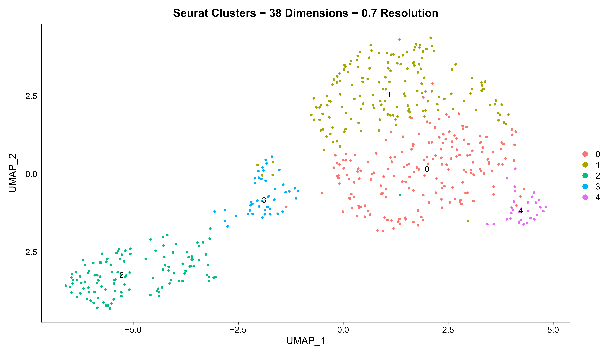
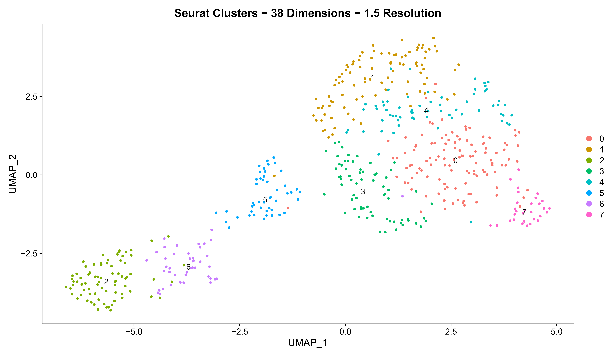
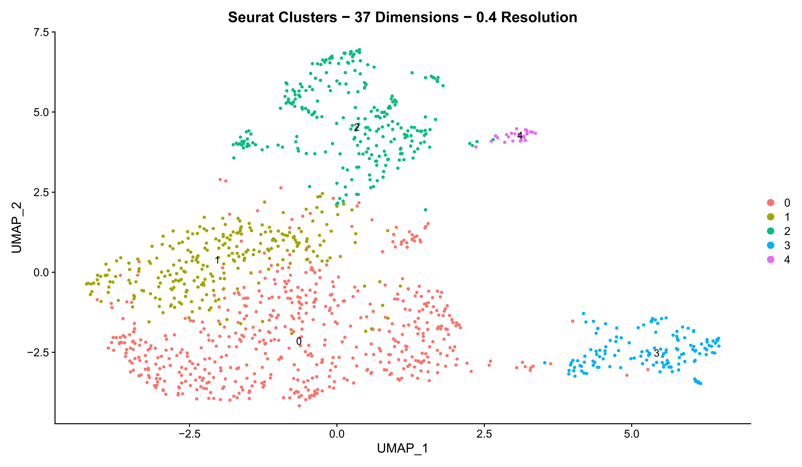
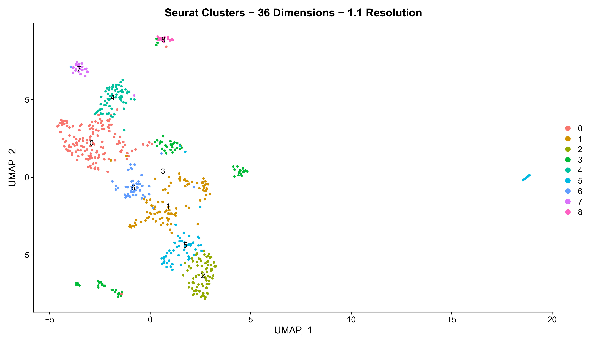
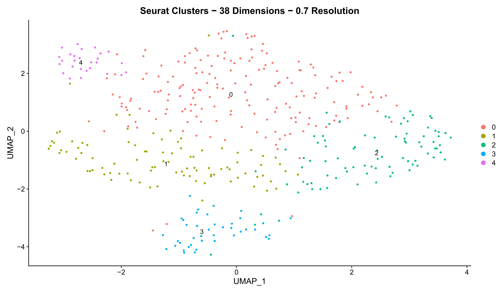
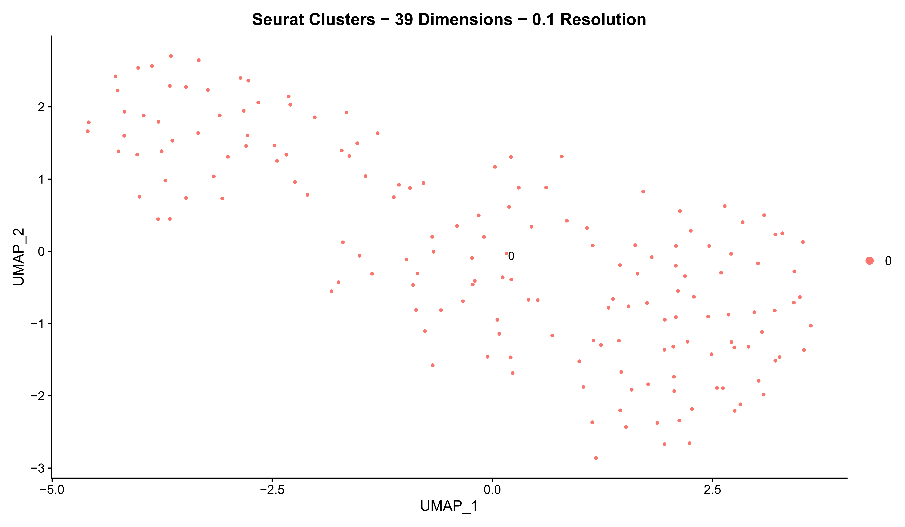

Annotation and Integration
================
Aaron Mohammed

``` r
library(Seurat)
library(ggplot2)
library(qpdf)
library(openxlsx)
library(plotly)
library(clusterProfiler)
library(org.Mm.eg.db)

seurat_input_dir <- file.path(getwd(), "singleR_annotated_seurats")

plots_dir <- file.path(getwd(), "Plots")
dir.create(plots_dir)

markers_dir <- file.path(getwd(), "Markers")
dir.create(markers_dir)

RDS_dir <- file.path(getwd(), "RDS_files")
dir.create(RDS_dir)
```

``` r
# Read in WT and WT seurats
WT_s <- readRDS(file.path(seurat_input_dir, "WT_singleR_annotated.rds"))

Idents(WT_s) <- "orig.ident"

WT_s$WT_SC_1 <- NULL
WT_s$WT_SC_2 <- NULL
WT_s$WT_SC_3 <- NULL
```

``` r
umap.func <- function (seurat, nfeat = 2000, cc_regress = FALSE, 
                       pca_npcs = 50, cumm_var = NULL, dims = NULL,
                       verb = FALSE) {
  
  if (is.null(cumm_var) & is.null(dims)) {
    stop("Number of PCs to use has not been set, use either 'cumm_var' or 'dims' to set it")
  } else if (!is.null(cumm_var) & !is.null(dims)) {
    stop("Set the number of PCs to use with either 'cumm_var' or 'dims', not both")
  } 
  
  DefaultAssay(seurat) <- "RNA"
  
  seurat <- FindVariableFeatures(seurat, 
                                 selection.method = "vst", 
                                 nfeatures = nfeat)
  
  if (cc_regress == TRUE) {
    seurat <- ScaleData(seurat, 
                        vars.to.regress = c("S.Score", "G2M.Score"),
                        verbose = verb)
  } else if (cc_regress == FALSE) {
    seurat <- ScaleData(seurat,
                        verbose = verb)
  }
  
  # Principal component analysis
  seurat <- RunPCA(seurat, 
                   npcs = pca_npcs,
                   verbose = verb)
  
  if (!is.null(cumm_var)) {
    
  # Percent variation associated with each PC
  pct <- seurat[["pca"]]@stdev / sum(seurat[["pca"]]@stdev) * 100
  
  # Cumulative variation with increasing number of PCs
  cumu <- cumsum(pct)
  
  PC <- which(cumu >= cumm_var)[1] 
  
  seurat <- FindNeighbors(seurat, 
                          dims = 1:PC,
                          verbose = verb)
  seurat <- RunUMAP(seurat,
                    dims = 1:PC,
                    verbose = verb)
  
  } else if (!is.null(dims)) {
    
    seurat <- FindNeighbors(seurat, 
                            dims = 1:dims,
                            verbose = verb)
    seurat <- RunUMAP(seurat,
                      dims = 1:dims,
                      verbose = verb)
    
  }
  
  return(seurat)

}
```

``` r
sweep.cluster.res <- function (seurat, res, path, fname) {
  
  i = 1
  file_paths <- vector(length = length(res))
  
  dims <- length(seurat@commands[["RunUMAP.RNA.pca"]]@params[["dims"]])
  
  for (r in res) {
    
    seurat <- FindClusters(seurat, 
                           resolution = r,
                           verbose = FALSE)
    
    title <- paste0("Seurat Clusters", sep= " - ",
                    dims, sep= " ",
                    "Dimensions", sep= " - ",
                    r, sep= " ",
                    "Resolution")
    
    file_name <- paste0("cluster_umap", sep= "_",
                        r, sep= "_",
                        "res.pdf")
    
    file_paths[i] <- file.path(path, file_name)
    
    pdf(file_paths[i], height = 7, width = 12)
    print(UMAPPlot(seurat, 
                   group.by = "seurat_clusters", 
                   label = TRUE) +
            ggtitle(title))
    dev.off()
    
    i = i + 1
    
  }
  
  pdf_combine(input = file_paths, 
              output = file.path(path, fname))
  
  file.remove(file_paths)
  
}
```

``` r
get.cons.markers <- function (seurat, ident, group, path, fname) {
  
  DefaultAssay(seurat) <- "RNA"
  seurat <- ScaleData(seurat, features = row.names(seurat))
  
  Idents(seurat) <- ident
  
  if (is.factor(seurat@meta.data[,ident])) {
    clusters <- levels(seurat@meta.data[,ident])
  } else if (is.character(seurat@meta.data[,ident])) {
    clusters <- sort(unique(seurat@meta.data[,ident]))
  }
  
  conserved_markers <- vector(mode = "list", length = length(clusters))
  names(conserved_markers) <- clusters
  
  for (clust in clusters) {
    conserved_markers[[clust]] <- FindConservedMarkers(seurat, 
                                                       ident.1 = clust,
                                                       grouping.var = group)
  }
  
  write.xlsx(conserved_markers, 
             file.path(path, fname), 
             rowNames = TRUE)
  
  return(conserved_markers)
  
}
```

``` r
get.all.markers <- function (seurat, ident, path, fname) {
  
  DefaultAssay(seurat) <- "RNA"
  seurat <- ScaleData(seurat, features = row.names(seurat))
  
  Idents(seurat) <- ident
  
  all_markers <- FindAllMarkers(seurat, logfc.threshold = 0.1)
  
  if (is.factor(seurat@meta.data[,ident])) {
    clusters <- levels(seurat@meta.data[,ident])
  } else if (is.character(seurat@meta.data[,ident])) {
    clusters <- sort(unique(seurat@meta.data[,ident]))
  }
  
  all_markers_list <- vector(mode="list", length = length(clusters))
  names(all_markers_list) <- clusters
  
  for (clust in clusters) {
    all_markers_list[[clust]] <- all_markers[which(all_markers$cluster == clust), 
                                             c("gene", "p_val", "avg_log2FC", 
                                               "pct.1", "pct.2", "p_val_adj")]
  }
  write.xlsx(all_markers_list, 
             file.path(path, fname), 
             rowNames = FALSE)
  
  return(all_markers_list)
  
}
```

``` r
WT_s <- umap.func(seurat = WT_s,
                  nfeat = 2000,
                  cc_regress = TRUE,
                  pca_npcs = 50,
                  cumm_var = 80,
                  verb = FALSE)

res <- seq(0.1,1.5,by=0.1)

WT_s <- FindClusters(WT_s, 
                         resolution = res,
                         verbose = FALSE)

sweep.cluster.res(seurat = WT_s,
                  res = res,
                  path = plots_dir,
                  fname = "1_WT_cluster_res_sweep.pdf")
```

``` r
WT_s <- FindClusters(WT_s, 
                         resolution = 0.8,
                         verbose = FALSE)

WT_s$WT_clusters <- WT_s$seurat_clusters

UMAPPlot(WT_s, group.by = "WT_clusters", label = TRUE)

saveRDS(WT_s, file.path(RDS_dir, "1_WT_seurat.rds"))
```

``` r
all_markers <- get.all.markers(seurat = WT_s,
                               ident = "WT_clusters",
                               path = markers_dir,
                               fname = "1_WT_markers.xlsx")

saveRDS(all_markers, file.path(markers_dir, "1_WT_markers.rds"))
```

``` r
WT_s <- AddMetaData(WT_s, rep(NA, length= nrow(WT_s@meta.data)), col.name = "broad_annot_1")

"Myocardial" -> WT_s@meta.data[which(WT_s$WT_clusters == 4 |
                                     WT_s$WT_clusters == 14), 
                               "broad_annot_1"]

"Epicardial" -> WT_s@meta.data[which(WT_s$WT_clusters == 0 |
                                     WT_s$WT_clusters == 2 |
                                     WT_s$WT_clusters == 12 |
                                     WT_s$WT_clusters == 15), 
                               "broad_annot_1"]


"Endocardial" -> WT_s@meta.data[which(WT_s$WT_clusters == 1 |
                                     WT_s$WT_clusters == 5 |
                                     WT_s$WT_clusters == 10 |
                                     WT_s$WT_clusters == 16), 
                               "broad_annot_1"]

"Mesenchymal" -> WT_s@meta.data[which(WT_s$WT_clusters == 3), 
                               "broad_annot_1"]

"MP" -> WT_s@meta.data[which(WT_s$WT_clusters == 6 |
                                     WT_s$WT_clusters == 9 |
                                     WT_s$WT_clusters == 11 |
                                     WT_s$WT_clusters == 18), 
                               "broad_annot_1"]

"Blood" -> WT_s@meta.data[which(WT_s$WT_clusters == 7 |
                                     WT_s$WT_clusters == 8 |
                                     WT_s$WT_clusters == 13 |
                                     WT_s$WT_clusters == 17), 
                               "broad_annot_1"]
```

``` r
UMAPPlot(WT_s, group.by = "WT_clusters", label = TRUE)
WT_umap <- UMAPPlot(WT_s, group.by = "broad_annot_1")

WT_myo_cells <- CellSelector(WT_umap)

WT_epi_cells <- CellSelector(WT_umap)
WT_epi_cells <- c(WT_epi_cells, CellSelector(WT_umap))

WT_endo_cells <- CellSelector(WT_umap)

WT_mes_cells <- CellSelector(WT_umap)

WT_MP_cells <- CellSelector(WT_umap)
WT_MP_cells <- c(WT_MP_cells, CellSelector(WT_umap))

WT_blo_cells <- CellSelector(WT_umap)
WT_blo_cells <- c(WT_blo_cells, CellSelector(WT_umap))


WT_s <- AddMetaData(WT_s, WT_s$broad_annot_1, col.name = "broad_annot_2")

"Myocardial" -> WT_s@meta.data[WT_myo_cells, "broad_annot_2"]
"Epicardial" -> WT_s@meta.data[WT_epi_cells, "broad_annot_2"]
"Endocardial" -> WT_s@meta.data[WT_endo_cells, "broad_annot_2"]
"Mesenchymal" -> WT_s@meta.data[WT_mes_cells, "broad_annot_2"]
"MP" -> WT_s@meta.data[WT_MP_cells, "broad_annot_2"]
"Blood" -> WT_s@meta.data[WT_blo_cells, "broad_annot_2"]


UMAPPlot(WT_s, group.by = "broad_annot_2")


FeaturePlot(WT_s, features = "Hba-a1") # Erythroid
FeaturePlot(WT_s, features = "Hba-a2") # Erythroid
FeaturePlot(WT_s, features = "Hbb-bt") # Erythroid
FeaturePlot(WT_s, features = "Alas2") # Erythroid
FeaturePlot(WT_s, features = "Fcgr1") # Immune
FeaturePlot(WT_s, features = "C1qa") # Immune
FeaturePlot(WT_s, features = "Cd68") # Immune
FeaturePlot(WT_s, features = "Rgs18") # Platelet
FeaturePlot(WT_s, features = "Pf4") # Platelet
FeaturePlot(WT_s, features = "Tubb1") # Platelet


FeaturePlot(WT_s, features = "Thy1") # Fibroblast
FeaturePlot(WT_s, features = "Tcf21") # Fibroblast
FeaturePlot(WT_s, features = "Wt1") # Fibroblast
FeaturePlot(WT_s, features = "Tbx18") # Fibroblast
```

``` r
Idents(WT_s) <- "broad_annot_2"
WT_myo <- subset(WT_s, idents = "Myocardial")
WT_epi <- subset(WT_s, idents = "Epicardial")
WT_endo <- subset(WT_s, idents = "Endocardial")
WT_mes <- subset(WT_s, idents = "Mesenchymal")
WT_mp <- subset(WT_s, idents = "MP")
WT_blo <- subset(WT_s, idents = "Blood")
```

``` r
umap.res.sweep <- function(seurat, nfeat = 2000, cc_regress = FALSE, 
                           pca_npcs = 50, cumm_var = NULL, dims = NULL,
                           verb = FALSE, res , path, fname) {
  
  seurat <- umap.func(seurat = seurat,
                    nfeat = nfeat,
                    cc_regress = cc_regress,
                    pca_npcs = pca_npcs,
                    cumm_var = cumm_var,
                    dims = dims,
                    verb = verb)

seurat <- FindClusters(seurat, 
                         resolution = res,
                         verbose = verb)

sweep.cluster.res(seurat = seurat,
                  res = res,
                  path = path,
                  fname = fname)

return(seurat)
  
}
```

``` r
res <- seq(0.1,1.5,by=0.1)

WT_myo <- umap.res.sweep(seurat = WT_myo,
                          nfeat = 2000,
                          cc_regress = TRUE,
                          pca_npcs = 50,
                          cumm_var = 80,
                          res = res,
                          path = plots_dir,
                          fname = "2_WT_myo_res_sweep.pdf",
                          verb = FALSE)
```



``` r
WT_endo <- umap.res.sweep(seurat = WT_endo,
                          nfeat = 2000,
                          cc_regress = TRUE,
                          pca_npcs = 50,
                          cumm_var = 80,
                          res = res,
                          path = plots_dir,
                          fname = "2_WT_endo_res_sweep.pdf",
                          verb = FALSE)
```



``` r
WT_epi <- umap.res.sweep(seurat = WT_epi,
                          nfeat = 2000,
                          cc_regress = TRUE,
                          pca_npcs = 50,
                          cumm_var = 80,
                          res = res,
                          path = plots_dir,
                          fname = "2_WT_epi_res_sweep.pdf",
                          verb = FALSE)
```


``` r
WT_mes <- umap.res.sweep(seurat = WT_mes,
                          nfeat = 2000,
                          cc_regress = TRUE,
                          pca_npcs = 50,
                          cumm_var = 80,
                          res = res,
                          path = plots_dir,
                          fname = "2_WT_mes_res_sweep.pdf",
                          verb = FALSE)
```


``` r
WT_mp <- umap.res.sweep(seurat = WT_mp,
                          nfeat = 2000,
                          cc_regress = TRUE,
                          pca_npcs = 50,
                          cumm_var = 80,
                          res = res,
                          path = plots_dir,
                          fname = "2_WT_mp_res_sweep.pdf",
                          verb = FALSE)
```



``` r
WT_blo <- umap.res.sweep(seurat = WT_blo,
                          nfeat = 2000,
                          cc_regress = TRUE,
                          pca_npcs = 50,
                          cumm_var = 80,
                          res = res,
                          path = plots_dir,
                          fname = "2_WT_blo_res_sweep.pdf",
                          verb = FALSE)
```


``` r
WT_myo <- FindClusters(WT_myo, 
                        resolution = 0.9,
                        verbose = FALSE)

WT_myo <- AddMetaData(WT_myo, WT_myo$seurat_clusters, col.name = "WT_myo_SC")

WT_endo <- FindClusters(WT_endo, 
                        resolution = 0.3,
                        verbose = FALSE)

WT_endo <- AddMetaData(WT_endo, WT_endo$seurat_clusters, col.name = "WT_endo_SC")

WT_epi <- FindClusters(WT_epi, 
                        resolution = 0.4,
                        verbose = FALSE)

WT_epi <- AddMetaData(WT_epi, WT_epi$seurat_clusters, col.name = "WT_epi_SC")

WT_mes <- FindClusters(WT_mes, 
                        resolution = 0.3,
                        verbose = FALSE)

WT_mes <- AddMetaData(WT_mes, WT_mes$seurat_clusters, col.name = "WT_mes_SC")

WT_mp <- FindClusters(WT_mp, 
                        resolution = 0.5,
                        verbose = FALSE)

WT_mp <- AddMetaData(WT_mp, WT_mp$seurat_clusters, col.name = "WT_mp_SC")

WT_blo <- FindClusters(WT_blo, 
                        resolution = 0.7,
                        verbose = FALSE)

WT_blo <- AddMetaData(WT_blo, WT_blo$seurat_clusters, col.name = "WT_blo_SC")
```

``` r
saveRDS(WT_myo, file.path(RDS_dir, "WT_myo.rds"))
saveRDS(WT_endo, file.path(RDS_dir, "WT_endo.rds"))
saveRDS(WT_epi, file.path(RDS_dir, "WT_epi.rds"))
saveRDS(WT_mes, file.path(RDS_dir, "WT_mes.rds"))
saveRDS(WT_mp, file.path(RDS_dir, "WT_mp.rds"))
saveRDS(WT_blo, file.path(RDS_dir, "WT_blo.rds"))
```

``` r
all_markers <- get.all.markers(seurat = WT_myo,
                               ident = "seurat_clusters",
                               path = markers_dir,
                               fname = "2_WT_myo_markers.xlsx")
saveRDS(all_markers, file.path(markers_dir, "2_WT_myo_markers.rds"))

################################################################################

all_markers <- get.all.markers(seurat = WT_endo,
                               ident = "seurat_clusters",
                               path = markers_dir,
                               fname = "2_WT_endo_markers.xlsx")
saveRDS(all_markers, file.path(markers_dir, "2_WT_endo_markers.rds"))

################################################################################

all_markers <- get.all.markers(seurat = WT_epi,
                               ident = "seurat_clusters",
                               path = markers_dir,
                               fname = "2_WT_epi_markers.xlsx")
saveRDS(all_markers, file.path(markers_dir, "2_WT_epi_markers.rds"))

################################################################################

all_markers <- get.all.markers(seurat = WT_mes,
                               ident = "seurat_clusters",
                               path = markers_dir,
                               fname = "2_WT_mes_markers.xlsx")
saveRDS(all_markers, file.path(markers_dir, "2_WT_mes_markers.rds"))

################################################################################

all_markers <- get.all.markers(seurat = WT_mp,
                               ident = "seurat_clusters",
                               path = markers_dir,
                               fname = "2_WT_mp_markers.xlsx")
saveRDS(all_markers, file.path(markers_dir, "2_WT_mp_markers.rds"))

################################################################################

all_markers <- get.all.markers(seurat = WT_blo,
                               ident = "seurat_clusters",
                               path = markers_dir,
                               fname = "2_WT_blo_markers.xlsx")
saveRDS(all_markers, file.path(markers_dir, "2_WT_blo_markers.rds"))
```

``` r
Idents(WT_myo) <- "seurat_clusters"
WT_myo_A <- subset(WT_myo, idents = c(0,1,3,6,4))

WT_myo_A <- AddMetaData(WT_myo_A, WT_myo_A$seurat_clusters, col.name = "orig")

WT_myo_A <- umap.res.sweep(seurat = WT_myo_A,
                          nfeat = 2000,
                          cc_regress = TRUE,
                          pca_npcs = 50,
                          cumm_var = 80,
                          res = res,
                          path = plots_dir,
                          fname = "3_WT_myo_A_res_sweep.pdf",
                          verb = FALSE)
```



``` r
0 -> WT_myo_A@meta.data[which(WT_myo_A$orig == 1 |
                                     WT_myo_A$orig == 3), 
                               "orig"]


cells <- CellSelector(UMAPPlot(WT_myo_A, group.by = "orig"))

4 -> WT_myo_A@meta.data[cells, "orig"]

UMAPPlot(WT_myo_A, group.by = "orig")


all_markers <- get.all.markers(seurat = WT_myo_A,
                               ident = "orig",
                               path = markers_dir,
                               fname = "3_WT_myo_A.xlsx")

saveRDS(all_markers, file.path(markers_dir, "3_WT_myo_A.rds"))
```

``` r
Idents(WT_myo) <- "seurat_clusters"
WT_myo_B <- subset(WT_myo, idents = c(2,4,5))

WT_myo_B <- AddMetaData(WT_myo_B, WT_myo$seurat_clusters, col.name = "orig")

WT_myo_B <- umap.res.sweep(seurat = WT_myo_B,
                          nfeat = 3000,
                          cc_regress = TRUE,
                          pca_npcs = 50,
                          cumm_var = 80,
                          res = res,
                          path = plots_dir,
                          fname = "3_WT_myo_B_res_sweep.pdf",
                          verb = FALSE)
```



``` r
UMAPPlot(WT_myo_B, group.by = "orig")

all_markers <- get.all.markers(seurat = WT_myo_B,
                               ident = "orig",
                               path = markers_dir,
                               fname = "3_WT_myo_B.xlsx")

saveRDS(all_markers, file.path(markers_dir, "3_WT_myo_B.rds"))
```

``` r
"Ventricular_1" -> WT_myo@meta.data[which(WT_myo$WT_myo_SC == 0 |
                                        WT_myo$WT_myo_SC == 1 |
                                        WT_myo$WT_myo_SC == 3), 
                                  "WT_myo_annot"]

"Ventricular_2" -> WT_myo@meta.data[which(WT_myo$WT_myo_SC == 4), "WT_myo_annot"]

"OFT" -> WT_myo@meta.data[which(WT_myo$WT_myo_SC == 6), "WT_myo_annot"]

"AVC" -> WT_myo@meta.data[which(WT_myo$WT_myo_SC == 5), "WT_myo_annot"]

"Atrial" -> WT_myo@meta.data[which(WT_myo$WT_myo_SC == 2), "WT_myo_annot"]

UMAPPlot(WT_myo, group.by = "WT_myo_SC", label = TRUE)
UMAPPlot(WT_myo, group.by = "WT_myo_annot", label = TRUE)

WT_myo <- AddMetaData(WT_myo, WT_myo$WT_myo_annot, col.name = "specific_annot_1")
```

``` r
UMAPPlot(WT_endo, group.by = "WT_endo_SC", label = TRUE)

"Endothelial" -> WT_endo@meta.data[which(WT_endo$WT_endo_SC == 0), 
                                  "WT_endo_annot"]

"EndMT" -> WT_endo@meta.data[which(WT_endo$WT_endo_SC == 1), "WT_endo_annot"]

"Vascular_EC" -> WT_endo@meta.data[which(WT_endo$WT_endo_SC == 2 |
                                         WT_endo$WT_endo_SC == 3), "WT_endo_annot"]

UMAPPlot(WT_endo, group.by = "WT_endo_annot", label = TRUE)

WT_endo <- AddMetaData(WT_endo, WT_endo$WT_endo_annot, col.name = "specific_annot_1")
```

``` r
UMAPPlot(WT_epi, group.by = "WT_epi_SC", label = TRUE)

"Epithelial" -> WT_epi@meta.data[which(WT_epi$WT_epi_SC == 1 |
                                       WT_epi$WT_epi_SC == 2 |
                                       WT_epi$WT_epi_SC == 3 |
                                       WT_epi$WT_epi_SC == 4),
                                 "WT_epi_annot"]

"EpiMT" -> WT_epi@meta.data[which(WT_epi$WT_epi_SC == 0), 
                            "WT_epi_annot"]

UMAPPlot(WT_epi, group.by = "WT_epi_annot", label = TRUE)

WT_epi <- AddMetaData(WT_epi, WT_epi$WT_epi_annot, col.name = "specific_annot_1")

UMAPPlot(WT_epi, group.by = "specific_annot_1", label = TRUE)
```

``` r
saveRDS(WT_endo, file.path(RDS_dir, "WT_endo.rds"))
saveRDS(WT_myo, file.path(RDS_dir, "WT_myo.rds"))
saveRDS(WT_epi, file.path(RDS_dir, "WT_epi.rds"))
```

``` r
WT_s <- AddMetaData(WT_s, rep(NA, length=nrow(WT_s@meta.data)), col.name = "specific_annot_1")

for (cell in row.names(WT_myo@meta.data)) {
  WT_myo@meta.data[cell, "specific_annot_1"] -> WT_s@meta.data[which(row.names(WT_s@meta.data) == cell), "specific_annot_1"]
}

for (cell in row.names(WT_endo@meta.data)) {
  WT_endo@meta.data[cell, "specific_annot_1"] -> WT_s@meta.data[which(row.names(WT_s@meta.data) == cell), "specific_annot_1"]
}

for (cell in row.names(WT_epi@meta.data)) {
  WT_epi@meta.data[cell, "specific_annot_1"] -> WT_s@meta.data[which(row.names(WT_s@meta.data) == cell), "specific_annot_1"]
}


"Blood" -> WT_s$specific_annot_1[which(WT_s$broad_annot_2 == "Blood")]
"Mesenchymal" -> WT_s$specific_annot_1[which(WT_s$broad_annot_2 == "Mesenchymal")]
"MP" -> WT_s$specific_annot_1[which(WT_s$broad_annot_2 == "MP")]

UMAPPlot(WT_s, group.by = "specific_annot_1")

saveRDS(WT_s, file.path(RDS_dir, "2_WT_seurat.rds"))
```
